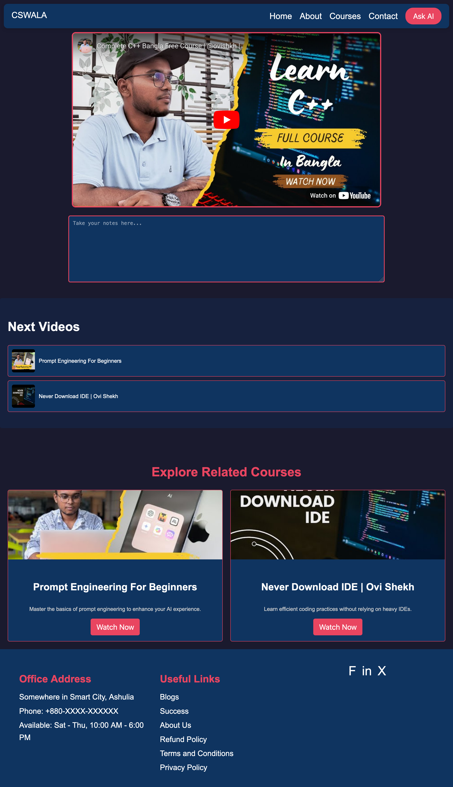
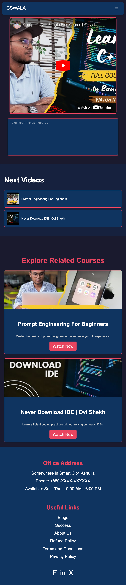

# CS Wala Course Player

A simple and interactive course video player designed for educational platforms. This project includes a main video player, a recommended video section, and a note-taking feature with persistent storage.

## Features

### 1. **Main Video Player**
- Plays the main course video using a YouTube embed iframe.
- Enforces course progression by requiring the user to complete the main video before accessing recommended videos.

### 2. **Recommended Video List**
- Displays recommended videos as thumbnails.
- Thumbnails are disabled until the main video is completed.
- Clicking on a thumbnail plays the selected video in the main video player.

### 3. **Note-Taking Section**
- Allows users to take notes while watching videos.
- Notes are automatically saved in the browser's `localStorage`.
- Previously saved notes are loaded when the page is refreshed.

### 4. **Responsive Design**
- Fully responsive layout optimized for both desktop and mobile devices.
- Dynamic adjustments for video player, sidebar, and note-taking sections.

### 5. **Modern UI**
- Clean and user-friendly interface inspired by **Programming Hero**.
- Utilizes custom color palettes for consistency.

## Technologies Used

### Frontend
- **HTML5**: For structuring the page elements.
- **CSS3**: For styling and responsive design.
- **JavaScript**: For interactive functionality.

### Local Storage
- Used for saving and loading user notes.

### YouTube Iframe API
- Embeds YouTube videos using iframes for playback.

## Installation & Usage

1. Clone the repository:
   ```bash
   git clone https://github.com/ovishkh/CSWALA.git
   cd Play


## Getting Started

1. Clone the repository:
   ```bash
   git clone https://github.com/ovishkh/CSWALA.git
   cd Play
   ```

2. Open the play.html file in any modern web browser:
   ```bash
   open play.html
   ```

   Interact with the main video player, recommended videos, and note-taking section.

## Folder Structure
```
cswala-course-player/
│
├── play.html          # Main HTML file
├── play.css           # CSS for styling the page
├── play.js            # JavaScript for interactivity
├── README.md          # Documentation
└── assets/            # Contains images/icons for thumbnails or logos (optional)
```

## How It Works

### Main Video Completion
- The main video is displayed in an iframe.
- A simulated timer or YouTube video completion event is used to determine when the user has completed watching the main video.
- Once the main video is completed, recommended video thumbnails are enabled for interaction.

### Recommended Videos
- Each recommended video is represented as a thumbnail with a title and image.
- Clicking a thumbnail updates the iframe source to play the selected video.

### Notes
- A text area is provided below the video for note-taking.
- Notes are saved automatically to localStorage whenever the user types.
- Saved notes are reloaded from localStorage when the page is refreshed.

## Customization

### Color Palette
To customize the website's appearance, modify the CSS variables in the :root section of play.css:

```css
:root {
    --primary-color: #0F3460;
    --accent-color: #E94560;
    --secondary-color: #16213E;
    --light-bg: #F8F9FA;
    --dark-text: #212529;
    --light-text: #FFFFFF;
    --subtle-gray: #6C757D;
}
```

### Adding New Videos
Add new recommended videos by editing the `<ul>` section in play.html:

```html
<li data-link="https://www.youtube.com/embed/videoID">
    
    <span>Video Title</span>
</li>
```

Replace `videoID` with the YouTube video ID and `thumbnail.jpg` with the thumbnail image URL.

## Future Enhancements
- Add video progress tracking using YouTube's API.
- Enable user authentication for personalized notes.
- Include a progress bar for course modules.
- Add a dark mode toggle for improved accessibility.

## License
This project is licensed under the MIT License. You are free to use, modify, and distribute this project.

## Screenshots
### Desktop View


### Mobile View


## Credits
- Developed by ` @Ovishkh `
- Inspired by the aesthetic and functionality of ` Jankar Mahbub's Platform  `
- Utilizes YouTube's iframe API for seamless video integration.


